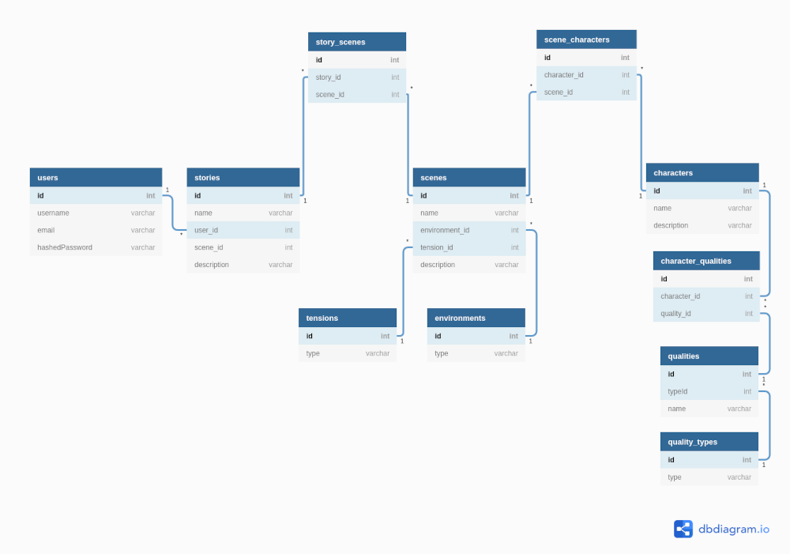
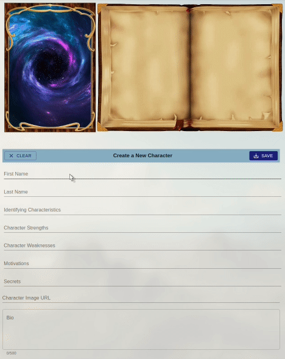

# **Muse**

---

## **Table of Contents**

- [Summary](#Summary)
- [Features](#Features)
- [Application Structure](#Application-Structure)
- [Database Schema](#Database-Schema)
- [Primary Components](#Primary-Components)
- [Placeholder](#Placeholder)

---

## **Summary**

- Muse helps story tellers move past "writer's block" through an easy to use interface to find or create characters, scenes, and story arcs. It is a place meant to spark a story teller's imagination so they can better tell their stories
- Muse is a single-page web application that utilizes an Express, React, Redux architecture.

---

## **Features**

Muse allows users to:

- Create an account
- Log in / out
- Create and search for character traits
- Create, read, update, and delete characters
- Add and remove characters from a scene
- Create, read, update, and delete scenes
- Add and remove scenes from a story arc
- Create, read, update, and delete story arcs

---

## **Application Structure**

- **Back end**

  - The application's back end server was built using Express and utilizes Sequelize as the ORM for the PostgreSQL database.
  - It is a RESTful structure that accepts AJAX calls using JSON.
  - The end points and SQL queries were structured to minimize the amount of queries while also being mindful of how the data was structured for Redux.

- **Front end**

  - The front end was built with React and Redux in order to give the user the most responsive experience possible.
  - All data is normalized so that accessing data remains in constant time as well as keeping the code clean and DRY.

- **Technologies**

  - [React.js](https://reactjs.org/)
  - [Redux](https://redux.js.org/)
  - [Material-UI](https://material-ui.com/)
  - [Express.js](https://expressjs.com/)
  - [Node.js](https://nodejs.org/en/)
  - [Sequelize ORM](https://sequelize.org/)
  - [PostgreSQL](https://www.postgresql.org/)

---

## **Database Schema**

---

## **Primary Components**

- Character Creator

  - Community generated traits allow easy to select characteristics that can be combined for unique characters
  