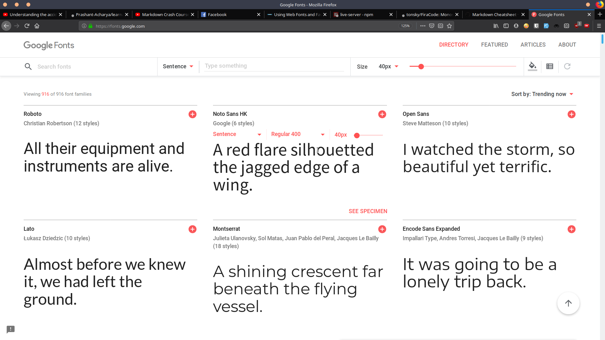
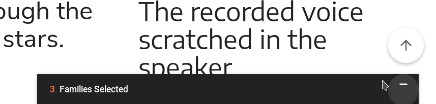
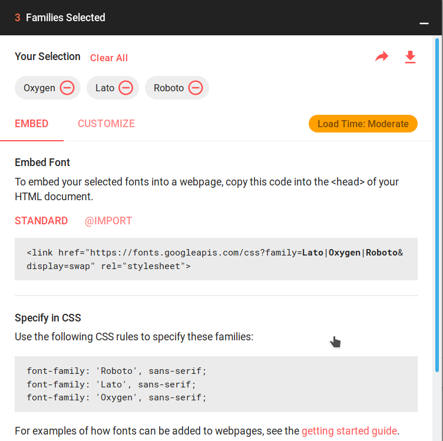
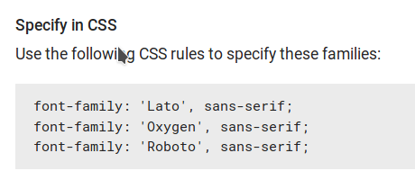

---
title: "Using Web Fonts and Icons"
subtitle: "A comprehensive guide to using web fonts and icons on a website"
date: '2019-06-10'
keywords: "HTML, CSS, Web Development, Learnathon, Sagarmatha, Fonts, Favicons"
writer: 'Prashant Acharya'
--- 

This tutorial is going to be a step by step solution to adding google fonts and icons similar to the ones in the picture below on a webpage.


To start, create a project folder with `index.html` file inside it. Add the necessary boilerplate code into the html file. The code should look like this at this point

```html
<!DOCTYPE html>
<html lang="en" dir="ltr">
	<head>
		<meta charset="utf-8">
		<title>Fonts and Favicon</title>
	</head>
	<body>
		
	</body>
</html>
```

### Adding Fonts
To add font on a website, we have to link the source to the font in either HTML or CSS of the webpage. For simplizity purpose, I will just talk about adding it in the HTML file.
For web fonts, I recommend using <a href='https://fonts.google.com' target='_blank'>Google Fonts</a>. So, click the link and visit the page.



Pick the fonts you like from the list by clicking the + icon from the list. I am picking `roboto`, `lato` & `oxygen` fonts. On the lower left corner you'll see something like this after selecting



Click anywhere in the rectangular box. You'll get a window like this 



Copy the code that looks like this

```html
 <link href="https://fonts.googleapis.com/css?family=Lato|Oxygen|Roboto&display=swap" rel="stylesheet">
```

Paste it into the head of your HTML document.

```html
<!DOCTYPE html>
<html lang="en" dir="ltr">
	<head>
		<meta charset="utf-8">
		<title>Fonts and Favicon</title>
		<link href="https://fonts.googleapis.com/css?family=Lato|Oxygen|Roboto&display=swap" rel="stylesheet">
	</head>
	<body>
		
	</body>
</html>
```

### Time for the test
Add an h1 in the body section of your web page.

```html
<body>
	<h1>Hello World</h1> //highlight-line
</body>
```

Create a CSS file, link it and add the following code into the CSS file
```css
h1{
	font-family: 'Roboto', sans-serif;
}
```
It is explained in the google fonts site as well.



## Adding Icons
To add icons there is a library called `font awesome` that provides us useful css to add icons on our web page. For more info visit the [official docs](https://fontawesome.com/).

To import the icons library, we simply have to add the following line of code in the head of our HTML document. Please note that the versioning of the library we are using.

```html
<link href="https://cdnjs.cloudflare.com/ajax/libs/font-awesome/5.8.2/css/all.min.css" rel='stylesheet'>
```

The library is imported in our project. Now, in order to use this in our website we have to use the classes it provides. The tag to use an icon is

```html
<i></i>
```

Now use a class that font awesome library provides. To see all the list of options you get, visit their official documentation at <a href='https://fontawesome.com/icons?d=gallery&m=free' target='_blank'>this link</a>.

```html
<i class='fab fa-facebook-square'></i>
```

The classes to use in the tag is all mentioned in the docs. Please refer to it and if you find any difficulties, you can always reach out to us.